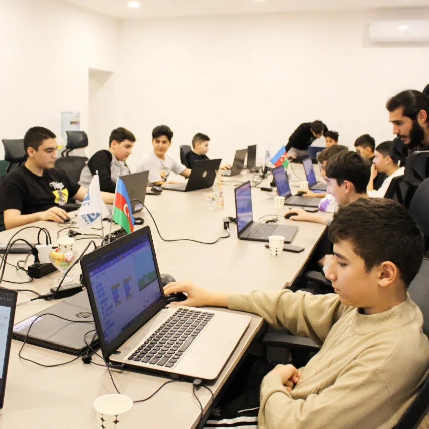

# Bootcamp -> nədir ?

 

### Proqramlaşdırma sahəsində Bootcamp adətən uşaqlara qısa müddət ərzində praktiki bacarıqlar əldə etməyə imkan verən intensiv və diqqətli təlim proqramına aiddir.

### Uşaqlara bu təlim keçməklə nə əldə edəcək:

 

> 💡 IT sahəsində istifadə olunan müasir texnologiya və anlayışlar ilə tanış olacaq; 
> 💡 Yaradıcı və intellektual bacarıqlarını inkişaf etdirəcək; 
> 💡 IT sahəsində güclü karyera qurmaq üçün doğru istiqamət seçimi edə biləcək; 
> 💡 IT sahəsində istifadə olunan müasir texnologiya və anlayışlar ilə tanış olacaq; 
> 💡 Yaradıcı və intellektual bacarıqlarını inkişaf etdirəcək; 
> 💡 IT sahəsində güclü karyera qurmaq üçün doğru istiqamət seçimi edə biləcək;

 

# Nələr öyrənəcəm🤩:

  

> 💫Scratch kimi vizual proqramlaşdırma dilindən istifadə edərək konsepsiyaların kodlaşdırılmasına giriş. 
> 💫Animasiyalar, oyunlar və proqramlar yaradacaq; 
> 💫HTML, CSS və JavaScript texnologiyaları vasitəsilə veb-səhifələr və veb-saytlar yaradacaq; 
> 💫Dünyanın ən populyar proqramlaşdırma dilləri olan JavaScript və Python ilə oyunlar, proqramlar və interfeyslər yaradacaq;  
> 💫Layihələri idarə etməyi öyrənəcək;

  

## BootCampin avantajlari ?

### ✅ Öyrənmə ve Sürətli bacarıq :

> 😇Bootcampdə sürətli bacarıq əldə etmək üçün nəzərdə tutulmuşdur. İştirakçılar nisbətən qısa müddət ərzində praktiki, işə hazır bacarıqlar əldə edə bilər ki, bu da onları karyerasını dəyişə və ya tez bir zamanda bacarıq əldə edə bilər. 
> 😇İştirakçılar daha papulyar akademik proqramlarla işləyə biləcək və diqqəti yayındırmadan mövzuya diqqət yetirə biləcəklər. 

  

> 😇Təlim düşərgələri tez-tez tədris planlarını real praktikalar ilə uyğunlaşdırılır, tələbələrin ən uyğun və tələb olunan bacarıqları öyrənməsini təmin edir. Bu, məşğulluğu artıra bilər. 
> 😇Rezyume yaratmaq, Web Sehife, Portfolio, Müsahibə hazırlamaq və şəbəkə imkanları daxil olmaqla karyera dəstəyi xidmətləri təqdim edir. Bu, yeni karyeraya keçid edən tələbələr üçün faydalı ola bilər.

## Niyə övladınızın Bootcamp-də məhz bizə etibar etməlisiniz? Bunun üçün bir neçə səbəb var:

🏋️‍♀️ Çətin mövzuları sadə dildə izah edən əla təlimçilərimiz var 
🥇 Dərslərimiz çox maraqlı keçir, hər dərs yeni mövzu və texnologiyaları əhatə edir; 
🎬 Hər dərsin video yazısı hazırlanır və dərsdən sonra uşaqlara göndərilir; 
💡 Dərslərdə istər əyani, istər online formatda iştirak etmək mümkündür; 
🎉 Kursu bitirən şagirdləri, onun bilik və bacarıqlarını təsdiq edən sertifikatla təmin edirik.

### Sonuc😊🥇:

Bootcap yazılmazdan əvvəl fərdlər öz öyrənmə üstünlüklərini, karyera məqsədlərini diqqətlə nəzərdən keçirməlidirlər .
